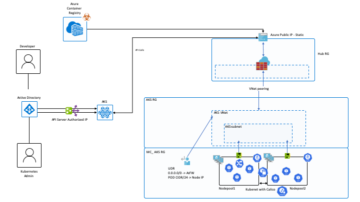

# AKS Secure Template

## Description

The repository contains the building blocks to create a secure Azure Kubernetes Service environment using Terraform. The premise is based on work done by Microsoft's Commercial Software engineering to create a pattern for enterprise deployments of Azure services. 

## Features

The Terraform templates are organized using terraform modules. This allows to compose the infrastructure components requiredbased on organizational needs. The two built scenarios provided are meant to be a turn-key solution for each scenario.

Scenario 1 can be found [here](./src/scenario1/main.tf).

The scenario outline is as follows:

* Azure Resource Group for AKS with the following resources

  * AKS Object
  * VNet that is configured through terraform variables
  * VNet peered to hub vnet
  * Any number of additional node Pools that can be configured by using a map vairable variable, with Cluster Autoscaling enabled for each node pool based on true or false and min max for each pool cn also be defined per node pool

* Resource Group for AZ Firewall and hub Vnet

  * Azure Firewall configured with allow rules for Restricted egress as outlined in <https://docs.microsoft.com/en-us/azure/aks/limit-egress-traffic>
  * A Log Analytics Workspace that will have the Azure Firewall logs being sent to it for analysis
  * Static Public IP for Azure Firewall with DNS name assigned
  * Vnet that can be configured through terraform variables
  * Vnet peering to AKS VNet

* AKS is deployed with the security features:

  * Pod Security Policy(Preview)
  * Calico Network Policy Module
  * Kubernetes with customizable CIDR ranges for Services, pods, and the docker bridge
  * Restricted Egress traffic as outlined in <https://docs.microsoft.com/en-us/azure/aks/limit-egress-traffic>
  * API server authorized IP Whitelisting as described in <https://docs.microsoft.com/en-us/azure/aks/api-server-authorized-ip-ranges>
  * (Optional) Azure AD integrated RBAC as outlined in <https://docs.microsoft.com/en-us/azure/aks/azure-ad-integration>
  * The AKS Created UDR for kubenet is updated with a new route of 0.0.0.0/0 to the internal IP of the AZ Firewall in the peered hub Vnet and assigned to the AKS subnet.

## Prerequisites

* Azure subscription with permissions to create:
  * Resource Groups, AKS, Event Hubs, Storage accounts, Azure Firewall and Network Operations.
* Bash shell (tested on Mac, Ubuntu, Windows with WSL2)
  * Will work in Cloud Shell

* Azure CLI 2.2.0+ ([download](https://docs.microsoft.com/en-us/cli/azure/install-azure-cli?view=azure-cli-latest))
* Visual Studio Code (optional) ([download](https://code.visualstudio.com/download))
* Terraform 0.12.24+

## Documentation

* Table of contents is at [docs/index.md](docs/index.md)

## Contributing

This project welcomes contributions and suggestions. Most contributions require you to agree to a
Contributor License Agreement (CLA) declaring that you have the right to, and actually do, grant us
the rights to use your contribution. For details, visit [Microsoft Contributor License Agreement](https://cla.opensource.microsoft.com).

When you submit a pull request, a CLA bot will automatically determine whether you need to provide
a CLA and decorate the PR appropriately (e.g., status check, comment). Simply follow the instructions
provided by the bot. You will only need to do this once across all repos using our CLA.

This project has adopted the [Microsoft Open Source Code of Conduct](https://opensource.microsoft.com/codeofconduct/).
For more information see the [Code of Conduct FAQ](https://opensource.microsoft.com/codeofconduct/faq/) or
contact [opencode@microsoft.com](mailto:opencode@microsoft.com) with any additional questions or comments.
